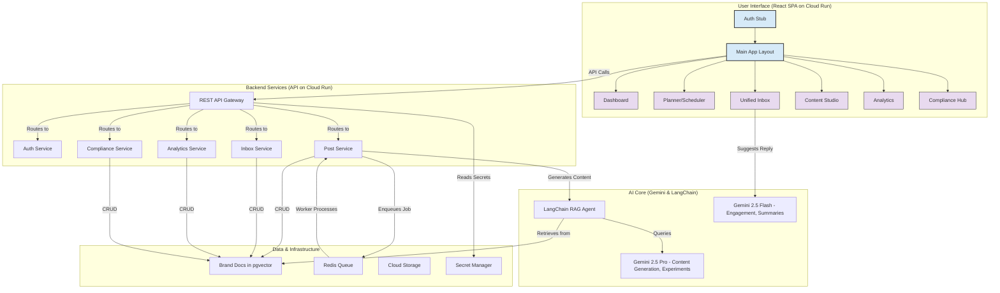

# AI Social Media OS for Healthcare

## Summary

This project is a scaffold for an "AI Social Media OS," a comprehensive, AI-powered platform tailored for healthcare clinics. It's designed to streamline social media management by integrating multi-channel posting, a unified inbox, and a brand-aware RAG system for content generation. Key features include an intuitive planner/scheduler, automated A/B testing, an AI engagement agent for replies, and robust attribution dashboards. A critical component is the built-in approval and compliance workflow, ensuring all content meets healthcare industry standards. This frontend is built with React, TypeScript, and Tailwind CSS, designed to connect to a scalable backend infrastructure.

---

## High-Level Architecture & Data Flow

This diagram describes the full-stack architecture this React frontend is designed to work with.



**Data Flow Explained:**

1.  **User Interaction**: A user interacts with the React frontend (e.g., creating a post in the Planner).
2.  **API Request**: The frontend makes a REST API call to the backend gateway on Cloud Run.
3.  **Backend Processing**: The gateway routes the request to the appropriate microservice (e.g., Post Service).
4.  **AI Invocation**: For content creation, the Post Service calls the LangChain RAG agent. This agent constructs a prompt using brand documents retrieved from the PostgreSQL/pgvector database and invokes Gemini for generation.
5.  **Asynchronous Jobs**: For scheduled posts or experiments, a job is pushed to the Redis queue. A separate worker process picks up the job and executes it.
6.  **Data Persistence**: All core data (posts, messages, user data, etc.) is stored in the Cloud SQL (PostgreSQL) database.
7.  **Security**: API keys and other secrets are securely managed by Secret Manager and accessed by the backend services.

---

## Setup

This project is a client-side React application. To run it, you need Node.js and a package manager like `pnpm` or `npm`.

1.  **Install dependencies:**
    ```bash
    npm install
    ```
    or
    ```bash
    pnpm install
    ```
2.  **Environment Variables:**
    Copy the `.env.example` file to a new file named `.env.local` and add your Gemini API Key. This is used by the frontend for any direct client-side AI calls.
    ```bash
    cp .env.example .env.local
    ```
3.  **Run the development server:**
    ```bash
    npm run dev
    ```
    or
    ```bash
    pnpm dev
    ```
The application will be available at `http://localhost:5173`. The health check is simulated on the client but is designed to hit a `/api/health` endpoint.
